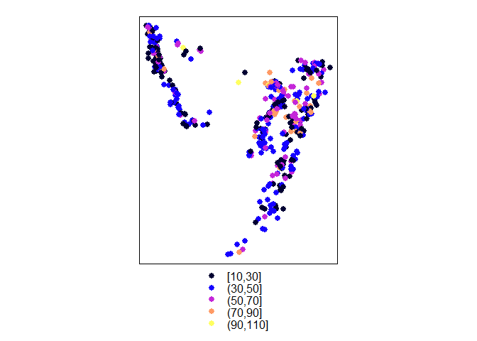

[](https://travis-ci.org/mdsumner/spdplyr)

<!-- README.md is generated from README.Rmd. Please edit that file -->
spdplyr
=======

`spdplyr` provides methods for the `dplyr` verbs for the `Spatial` classes in the `sp` package.

Installation
------------

Spdplyr can be installed directly from github:

``` r
devtools::install_github("mdsumner/spdplyr")
```

dplyr verbs for Spatial
=======================

Apply `dplyr` verbs to the attribute data of `sp` objects with dplyr verbs.

See `?dplyr-Spatial'` for supported verbs.

``` r
data(quakes)
library(sp)
coordinates(quakes) <- ~long+lat
library(spdplyr)
## plot a subset of locations by number of stations
quakes %>% dplyr::filter(mag <5.5 & mag > 4.5) %>% select(stations) %>% spplot
```

<!-- -->

We can use polygons and lines objects as well.

``` r
library(maptools)
#> Checking rgeos availability: TRUE
data(wrld_simpl)
## put the centre-of-mass centroid on wrld_simpl as an attribute and filter/select
worldcorner <- wrld_simpl %>% 
  mutate(lon = coordinates(wrld_simpl)[,1], lat = coordinates(wrld_simpl)[,2]) %>% 
  filter(lat < -20, lon > 60) %>% 
  select(NAME)

## demonstrate that we have a faithful subset of the original object
plot(worldcorner, asp = "")
text(coordinates(worldcorner), label = worldcorner$NAME, cex = 0.6)
```

<!-- -->

``` r

worldcorner
#> class       : SpatialPolygonsDataFrame 
#> features    : 6 
#> extent      : -178.6131, 179.0769, -54.74973, -10.05167  (xmin, xmax, ymin, ymax)
#> coord. ref. :  +proj=longlat +ellps=WGS84 +datum=WGS84 +no_defs +towgs84=0,0,0 
#> variables   : 1
#> Source: local data frame [6 x 1]
#> 
#>                                  NAME
#>                                (fctr)
#> 1                           Australia
#> 2                       New Caledonia
#> 3                      Norfolk Island
#> 4 French Southern and Antarctic Lands
#> 5   Heard Island and McDonald Islands
#> 6                         New Zealand

## we can chain together standard operations as well as dplyr specific ones
wrld_simpl %>% as("SpatialLinesDataFrame") %>% summarise(big = max(AREA))
#> class       : SpatialLinesDataFrame 
#> features    : 1 
#> extent      : -180, 180, -90, 83.57027  (xmin, xmax, ymin, ymax)
#> coord. ref. : +proj=longlat +ellps=WGS84 +datum=WGS84 +no_defs +towgs84=0,0,0 
#> variables   : 1
#> Source: local data frame [1 x 1]
#> 
#>       big
#>     (int)
#> 1 1638094
```

This approach is limited to the simple verbs `arrange`, `distinct`, `filter`, `mutate`, `rename`, `select`, `slice`, `transmute`, and `summarize`. Summarize either on its own or after a `group_by` collapses to a non-topological union of all sub-geometries within a group without any consideration of topology or relationships.

**BEWARE**: This is not a proven method for dealing with Spatial data, use at your own risk.

How does it work?
-----------------

Most of it is easy, simply applying the analogous operation of the verb to the Spatial\*DataFrame and subsetting/re-organizing as necessary. Some operations use the `spbabel::sptable` approach which provides a loss-less way to do what `ggplot2::fortify` does and its reverse.

Issues
======

Related work is in `spbabel`, `gris`, `dplyrodbc`, `manifoldr`, `sp.df` and `rastertable`.

<https://github.com/mdsumner/spbabel> <https://github.com/mdsumner/gris> <https://github.com/mdsumner/dplyrodbc> <https://github.com/mdsumner/manifoldr> <https://github.com/mdsumner/sp.df> <https://github.com/mdsumner/rastertable>
